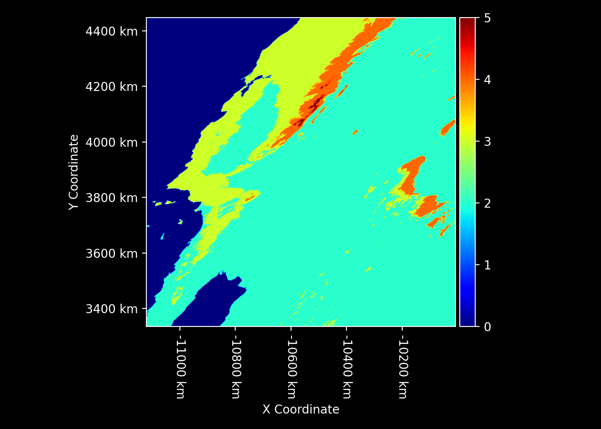

# `koppengeiger` Python Package

The `koppengeiger` Python package generates rasters of [Köppen-Geiger land-cover classification](https://koppen.earth/).

[Gregory H. Halverson](https://github.com/gregory-halverson-jpl) (they/them)<br>
[gregory.h.halverson@jpl.nasa.gov](mailto:gregory.h.halverson@jpl.nasa.gov)<br>
NASA Jet Propulsion Laboratory 329G

## Loading Köppen-Geiger Land-Cover Classification Raster

The function `load_koppen_geiger` is used to load a subset of the Köppen-Geiger land-cover classification raster as a `rasters.Raster` object. The Köppen-Geiger land-cover classification is a widely used vegetation and climate classification system. More details about this classification system can be found at Koppen Earth.

### Parameters

- `geometry` (RasterGeometry, optional): The geometry to which the raster should be transformed. If None, the original raster geometry is used.

### Returns

- `Raster`: The loaded Köppen-Geiger land-cover classification raster, potentially transformed to the given geometry.

### Usage

```python
import numpy as np
import rasters as rt
import modland
from koppengeiger import load_koppen_geiger

geometry = modland.generate_modland_grid(8, 5, 2400)
land_cover = load_koppen_geiger(geometry)
land_cover
```




## References

Beck, H. E., Zimmermann, N. E., McVicar, T. R., Vergopolan, N., Berg, A., & Wood, E. F. (2018). Present and future Köppen-Geiger climate classification maps at 1-km resolution. Scientific Data, 5, 180214.
